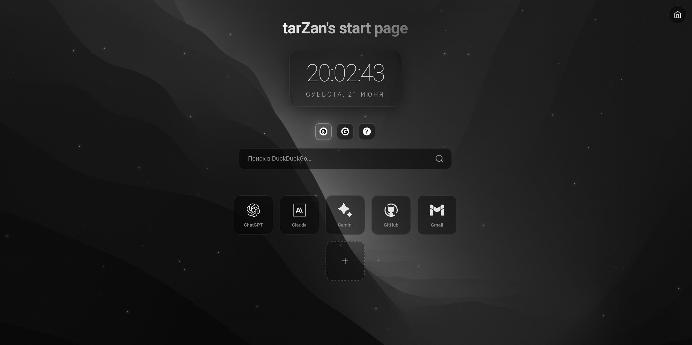
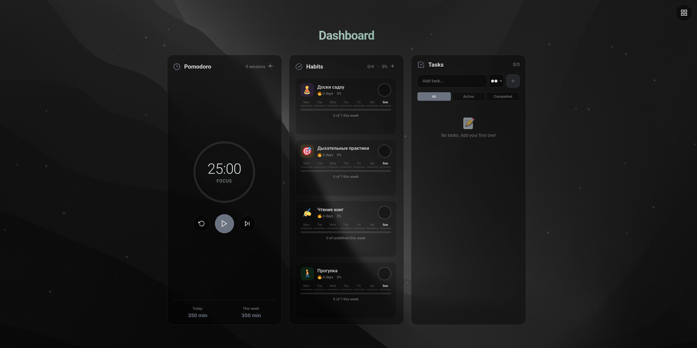

# ⚔️ tarZan's Start Page

<p align="center">
  <a href="https://github.com/TarzZan52/startpage/stargazers"></a>
  <a href="https://github.com/TarzZan52/startpage/network/members"></a>
  <a href="https://github.com/TarzZan52/startpage/issues"></a>
  <a href="https://github.com/TarzZan52/startpage"></a>
  <a href="https://github.com/TarzZan52/startpage/blob/main/LICENSE"></a>
</p>

<p align="center">
  <a href="https://github.com/TarzZan52/startpage/commits/main"></a>
  <a href="https://github.com/TarzZan52/startpage"></a>
  <a href="https://github.com/TarzZan52/startpage"></a>
  <a href="https://github.com/TarzZan52/startpage"></a>
</p>

<div align="center">
  <h3>Minimalist and customizable browser start page.</h3>
  <p>Add links to your favorite sites, switch between search engines, and display current time. All settings are stored locally in your browser.</p>
</div>

<br>

<p align="center">
  
</p>

<p align="center">
  
</p>

---

## ⚡ Quick Installation

**🐧 Linux:** Run `./server/install-service-linux.sh`

After installation, open http://localhost:8000/ in your browser.

<details>
<summary>📋 Detailed Installation Instructions</summary>

### Automatic Installation (Recommended)

Download the project and run **one file** for automatic setup:

#### 🐧 Linux:
```bash
git clone https://github.com/TarzZan52/startpage.git
cd startpage/server
./install-service-linux.sh
```

After installation, startpage will:
- ✅ Automatically start on system boot
- ✅ Run in background
- ✅ Be available at http://localhost:8000/

### Manual Launch (without auto-start)

If you don't want automatic startup, you can run manually:

#### macOS / Linux (manual mode):
```bash
cd startpage
python3 -m http.server 8000
# Open http://localhost:8000/
```

</details>

---

## 🏠 Set as Home Page

<details>
<summary>🔗 Browser Extensions (Recommended)</summary>

Install an extension to replace the new tab:

- **Firefox**: [New Tab Override](https://addons.mozilla.org/firefox/addon/new-tab-override/)
- **Chrome**: [New Tab Redirect](https://chrome.google.com/webstore/detail/new-tab-redirect/icpgjfneehieebagbmdbhnlpiopdcmna)

After installation:
1. Open extension settings
2. Enter URL: `http://localhost:8000/`
3. Save changes

</details>

<details>
<summary>⚙️ Browser Settings</summary>

**Firefox:**
1. Settings → Home → Homepage
2. Enter: `http://localhost:8000/`

**Chrome/Edge:**
1. Settings → On startup → Open page
2. Add: `http://localhost:8000/`

</details>

---

## 🌟 Features

### 🏠 Start Page
- **Search engines**: DuckDuckGo, Google, Yandex with easy switching
- **App tiles**: Add up to 12 custom application shortcuts
- **Date & Time**: Real-time display with 24-hour format
- **Responsive design**: Works on desktop and mobile devices

### 📊 Dashboard Mode
- **🍅 Pomodoro Timer**: Focus sessions with customizable work/break intervals
- **📅 Habit Tracker**: Track daily habits with weekly goals (1-7 times per week)
- **✅ Task Manager**: Add, organize, and complete tasks with priority levels
- **📈 Statistics**: Visual progress tracking for all productivity tools

### 🎨 Customization
- **App Editor**: Add custom applications with automatic favicon detection
- **Local Storage**: All data stored securely in your browser
- **Clean Interface**: Minimalist design with smooth animations

---

## 🛠️ Server Management

<details>
<summary>🐧 Linux Commands</summary>

**Service Management:**
```bash
# Check status
sudo systemctl status dashboard.service

# Stop
sudo systemctl stop dashboard.service

# Start
sudo systemctl start dashboard.service

# Restart
sudo systemctl restart dashboard.service

# View logs
sudo journalctl -u dashboard.service -f
```

**Complete Removal:**
```bash
cd startpage/server
./uninstall-service-linux.sh
```

</details>

---

## 🛠️ Troubleshooting

<details>
<summary>❌ Python Not Found</summary>

**Linux:**
```bash
# Ubuntu/Debian
sudo apt update && sudo apt install python3

# CentOS/RHEL
sudo yum install python3

# Arch Linux
sudo pacman -S python
```

**macOS:**
```bash
# Via Homebrew
brew install python3

# Or download from python.org
```

</details>

<details>
<summary>🔒 Port 8000 Busy</summary>

If port 8000 is already in use by another application:

1. **Stop conflicting application:**
   ```bash
   # Linux/macOS
   sudo lsof -i :8000
   sudo kill -9 <PID>
   ```

2. **Or change port in scripts** (e.g., to 8080)

</details>

<details>
<summary>🌐 Can't Open in Browser</summary>

- Check firewall settings
- Try alternative addresses:
  - `http://127.0.0.1:8000/`
  - `http://0.0.0.0:8000/`
- Ensure server is running (see management commands above)

</details>

---

## 📄 License

This project is licensed under the MIT License. See [LICENSE](LICENSE) file for details.

## 🤝 Contributing

Contributions are welcome! Feel free to create Issues or Pull Requests with suggestions and improvements.

---

<div align="center">
  <p>Made with ❤️ by <a href="https://github.com/TarzZan52">TarzZan52</a></p>
</div>