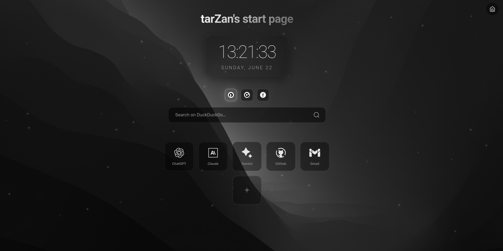
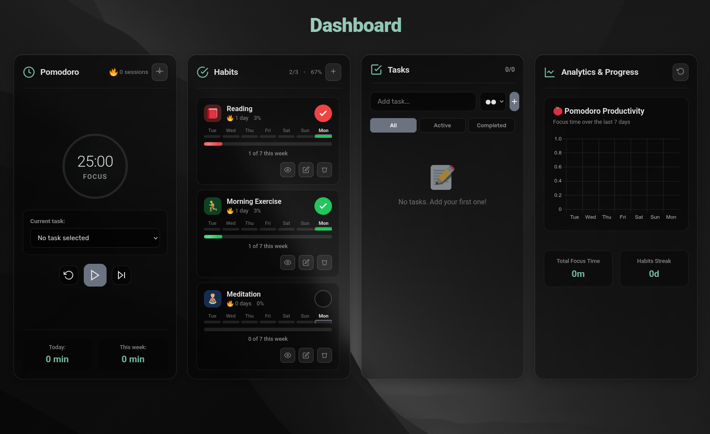

# ⚔️ tarZan's Start Page

<p align="center">
  <a href="https://github.com/TarzZan52/startpage/stargazers"></a>
  <a href="https://github.com/TarzZan52/startpage/network/members"></a>
  <a href="https://github.com/TarzZan52/startpage/issues"></a>
  <a href="https://github.com/TarzZan52/startpage"></a>
  <a href="https://github.com/TarzZan52/startpage/blob/main/LICENSE"></a>
</p>

<p align="center">
  <a href="https://github.com/TarzZan52/startpage/commits/main"></a>
  <a href="https://github.com/TarzZan52/startpage"></a>
  <a href="https://github.com/TarzZan52/startpage"></a>
  <a href="https://github.com/TarzZan52/startpage"></a>
</p>

<div align="center">
  <h3>Minimalist browser start page with productivity dashboard</h3>
  <p>Search engines, app shortcuts, Pomodoro timer, habit tracker, and todo list. All data stored locally.</p>
</div>

<br>




## 🚀 Installation

**Linux (automatic):**
```bash
git clone https://github.com/TarzZan52/startpage.git
cd startpage/server
./install-service-linux.sh
```

**Manual (any OS):**
```bash
cd startpage
python3 -m http.server 8000
```

Open http://localhost:8000/ in your browser.

**Set as homepage:** Use browser extensions like New Tab Override (Firefox) or New Tab Redirect (Chrome).

## ✨ Features

**Start Page:**
- Multi-engine search (DuckDuckGo, Google, Yandex)
- Customizable app shortcuts (up to 12)
- Real-time date & time

**Dashboard:**
- 🍅 Pomodoro timer with task integration
- 📅 Habit tracker with weekly goals
- ✅ Todo list with priorities and time tracking
- 📈 Progress analytics

All data stored locally. Works on desktop and mobile.

## ⚙️ Management

**Linux service commands:**
```bash
sudo systemctl status/start/stop/restart dashboard.service
./uninstall-service-linux.sh  # Complete removal
```

**Common issues:**
- **Python not found:** Install python3 via your package manager
- **Port 8000 busy:** Kill process with `sudo lsof -i :8000` or change port
- **Can't connect:** Check firewall, try `127.0.0.1:8000`

## 📄 License

MIT License - see [LICENSE](LICENSE) file.

<div align="center">
  Made with ❤️ by <a href="https://github.com/TarzZan52">TarzZan52</a>
</div>