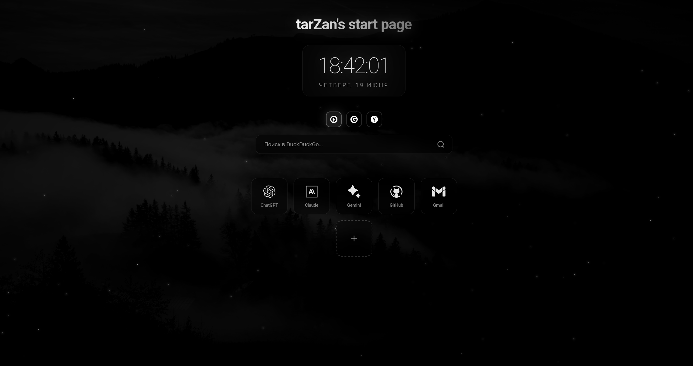

# ⚔️ tarZan's start page

<p align="center">
  <a href="https://github.com/TarzZan52/startpage/stargazers"></a>
  <a href="https://github.com/TarzZan52/startpage/network/members"></a>
  <a href="https://github.com/TarzZan52/startpage/issues"></a>
  <a href="https://github.com/TarzZan52/startpage"></a>
  <a href="https://github.com/TarzZan52/startpage/blob/main/LICENSE"></a>
</p>

<p align="center">
  <a href="https://github.com/TarzZan52/startpage/commits/main"></a>
  <a href="https://github.com/TarzZan52/startpage"></a>
  <a href="https://github.com/TarzZan52/startpage"></a>
  <a href="https://github.com/TarzZan52/startpage"></a>
</p>

<div align="center">
  <h3>Минималистичная и кастомизируемая стартовая страница для браузера.</h3>
  <p>Позволяет добавлять ссылки на любимые сайты, переключаться между поисковыми системами и отображает текущее время. Все настройки хранятся локально в вашем браузере.</p>
</div>

<br>

<p align="center">
  
</p>

---

## ⚡ Быстрая установка

**🐧 Linux:** Выполните `./server/install-service-linux.sh`

После установки откройте http://localhost:8000/ в браузере.

<details>
<summary>📋 Подробные инструкции по установке</summary>

### Автоматическая установка (рекомендуется)

Скачайте проект и запустите **один файл** для автоматической настройки:

#### 🐧 Linux:
```bash
git clone https://github.com/TarzZan52/startpage.git
cd startpage/server
./install-service-linux.sh
```

После установки startpage будет:
- ✅ Автоматически запускаться при входе в систему
- ✅ Работать в фоновом режиме
- ✅ Доступен по адресу http://localhost:8000/

### Ручной запуск (без автозапуска)

Если не хотите автоматический запуск, можете запускать вручную:

#### macOS / Linux (ручной режим):
```bash
cd startpage
python3 -m http.server 8000
# Откройте http://localhost:8000/
```

</details>

---

## 🏠 Установка как домашняя страница

<details>
<summary>🔗 Расширения для браузера (рекомендуется)</summary>

Установите расширение для замены новой вкладки:

- **Firefox**: [New Tab Override](https://addons.mozilla.org/firefox/addon/new-tab-override/)
- **Chrome**: [New Tab Redirect](https://chrome.google.com/webstore/detail/new-tab-redirect/icpgjfneehieebagbmdbhnlpiopdcmna)

После установки:
1. Откройте настройки расширения
2. Введите URL: `http://localhost:8000/`
3. Сохраните изменения

</details>

<details>
<summary>⚙️ Настройки браузера</summary>

**Firefox:**
1. Настройки → Начало → Домашняя страница
2. Введите: `http://localhost:8000/`

**Chrome/Edge:**
1. Настройки → При запуске → Открыть страницу
2. Добавьте: `http://localhost:8000/`

</details>

---

## 🛠️ Управление сервером

<details>
<summary>🐧 Linux команды</summary>

**Управление сервисом:**
```bash
# Проверить статус
sudo systemctl status dashboard.service

# Остановить
sudo systemctl stop dashboard.service

# Запустить
sudo systemctl start dashboard.service

# Перезапустить
sudo systemctl restart dashboard.service

# Просмотр логов
sudo journalctl -u dashboard.service -f
```

**Полное удаление:**
```bash
cd startpage/server
./uninstall-service-linux.sh
```

</details>

---

## 🛠️ Устранение неполадок

<details>
<summary>❌ Python не найден</summary>

**Linux:**
```bash
# Ubuntu/Debian
sudo apt update && sudo apt install python3

# CentOS/RHEL
sudo yum install python3

# Arch Linux
sudo pacman -S python
```

**macOS:**
```bash
# Через Homebrew
brew install python3

# Или скачайте с python.org
```

</details>

<details>
<summary>🔒 Порт 8000 занят</summary>

Если порт 8000 уже используется другим приложением:

1. **Остановите конфликтующее приложение:**
   ```bash
   # Linux/macOS
   sudo lsof -i :8000
   sudo kill -9 <PID>
   ```

2. **Или измените порт в скриптах** (например, на 8080)

</details>

<details>
<summary>🌐 Не открывается в браузере</summary>

- Проверьте файрвол
- Попробуйте альтернативные адреса:
  - `http://127.0.0.1:8000/`
  - `http://0.0.0.0:8000/`
- Убедитесь, что сервер запущен (см. команды управления выше)

</details>

---

## 📄 Лицензия

Этот проект распространяется под лицензией MIT. Подробности в файле [LICENSE](LICENSE).

## 🤝 Вклад в проект

Приветствуются любые предложения и улучшения! Не стесняйтесь создавать Issue или Pull Request.

---

<div align="center">
  <p>Сделано с ❤️ by <a href="https://github.com/TarzZan52">TarzZan52</a></p>
</div>